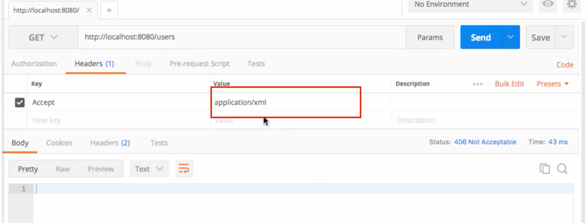

Currently, our api is not accepting any response in xml format

To accept an xml representation, let's add another dependency in our pom.xml file
 

**Just add these in your dependency and the xml representation will now work in postman**
<!-- https://mvnrepository.com/artifact/com.fasterxml.jackson.dataformat/jackson-dataformat-xml -->
<dependency>
    <groupId>com.fasterxml.jackson.dataformat</groupId>
    <artifactId>jackson-dataformat-xml</artifactId>
    <version>2.13.3</version>
</dependency>

